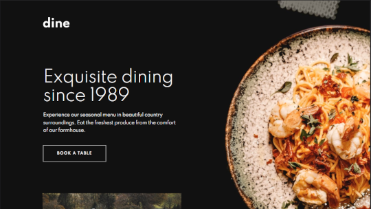

# dine-website

# Frontend Mentor - Dine Website Challenge solution

This is my solution to the [Dine Website Challenge challenge on Frontend Mentor](https://www.frontendmentor.io/challenges/dine-restaurant-website-yAt7Vvxt7). Frontend Mentor has helped me improve my coding skills by building realistic projects using Figma Design Files.

## Table of contents

- [Overview](#overview)
  - [The challenge](#the-challenge)
  - [Screenshot](#screenshot)
  - [Links](#links)
- [My process](#my-process)
  - [Built with](#built-with)
  - [What I learned](#what-i-learned)
  - [Continued development](#continued-development)
- [Author](#author)

## Overview

### The challenge

Users should be able to:

- View the optimal layout for each page depending on their device's screen size
- See hover states for all interactive elements throughout the site
- See the correct content for the Family Gatherings, Special Events, and Social Events section when the user clicks each tab
- Receive an error message when the booking form is submitted if:
  - The `Name` or `Email Address` fields are empty should show "This field is required"
  - The `Email Address` is not formatted correctly should show "Please use a valid email address"
  - Any of the `Pick a date` or `Pick a time` fields are empty should show "This field is incomplete"
  - The `month` and `date` that is picked in not in the past and if it is should show "Date must be in future"
  - The `year` can only be the current year or one year in the future
- The number of people in reservation able to be increased and decreased:
  - The amount of people does not go below 0 or above 30
  - When the user tries to increase to more than 30 people the number does not go up past 30 and an error message says "Sorry we can not accommodate parties larger than 30"

### Screenshot



### Links

- Solution URL: [Dine Site Solution](https://www.frontendmentor.io/solutions/responsive-site-using-html-css-js-ARqsqveXn)
- Live Site URL: [Dine Live Site](https://heathersmanski.com/dine-site/)

## My process

### Built with

- HTML5
- CSS
- Flexbox
- JavaScript
- Desktop-first workflow
- Visual Studio Code

### What I learned

I learned about creating a multi-page site using a Figma file to create a pixel perfect interpretation of the design. I learned about JavaScript this project creating the interactive events section and the reservation form. I learned about form validation and making sure the user has a smooth reservation process. This was not a tutorial project I created it all from scratch using the Figma design and solving all the coding challenges on my own.

- The homepage has an interactive events section

  - In this section the image, text and menu text change depending on the users selection of Family Gatherings, Special Events, or Social Events

  * To accomplish this effect I used JavaScript. I created the hidden class in css that could be added to the different elements that can be added or removed depending on which menu the user selected

  * I than created a function in JavaScript for each menu selection that says which elements should be shown and which should be hidden

  * Next I created and event listener to each of the menu name the user can select and called the correct function for each menu item.

```css
.hidden {
  visibility: hidden;
  display: none;
}
```

```js
function familyBtnChanges() {
  familyContent.classList.remove("hidden");
  specialContent.classList.add("hidden");
  socialContent.classList.add("hidden");

  familyLine.classList.add("change");
  specialLine.classList.remove("change");
  socialLine.classList.remove("change");

  familyMenuText.style.opacity = 1;
  imageChange.style.backgroundImage =
    "url(./images/homepage/family-gathering-desktop.jpg)";
}

familyMenuBtn.addEventListener("click", () => {
  familyBtnChanges();
});
```

- I learned a lot about form validation in this project.

  - I created a function that was run when the Make Reservation button was clicked to make sure every input field was filled out. If not an error message would show and the line for input field would turn red.

  * In this function it checks that every input field has a value. If it does not than the boolean valid changes to false and triggers the form not to be sent.

  * The function called resetForm is called at the top to reset all of the error messages and lines back to black. It is called at the top so that everytime the Make Reservation button is clicked it resets everything and than checks the values are there again. This way if the user enters their name but all the rest are blank. The name errors will go away but all the rest that are blank will show errors.

```js
function validateForm() {
  let name = document.getElementById("name").value;
  let email = document.getElementById("email").value;
  let month = document.getElementById("month").value;
  let day = document.getElementById("day").value;
  let year = document.getElementById("year").value;
  let hour = document.getElementById("hour").value;
  let minute = document.getElementById("minute").value;

  resetForm();

  if (name == "") {
    nameWrapper.classList.add("change");
    nameError.classList.remove("hidden");
    valid = false;
  }

  if (email == "") {
    emailWrapper.classList.add("change-email");
    emailError.classList.remove("hidden");
    valid = false;
  }

  if (month == "" || day == "" || year == "") {
    dateWrapper.classList.add("change");
    dateError.classList.remove("hidden");
    valid = false;
  }

  if (hour == "" || minute == "") {
    timeWrapper.classList.add("change");
    timeError.classList.remove("hidden");
    valid = false;
  }
  checkFutureDate();

  if (!futureDate) {
    valid = false;
  }
  return valid;
}
```

- I learned how to validate the date picker so that only the current year and one year can be shown.
  - I wanted the year to be dynamic and not hard coded. So I created a function to change the min and max values for the year input. This way an error will display if the year is not the current year or 1 year in the future.

```js
const year = document.getElementById("year");

const today = new Date().getFullYear();
const future = new Date().getFullYear() + 1;

year.setAttribute("min", today);
year.setAttribute("max", future);
```

- The date that could be selected I wanted to make sure that it was only a date in the future that would be able to be selected
  - To achieve this I created a function to check the month date and year to make sure the selection is in the future. If it is not in the future it will show "Date must be in future".
  - The function first creates variable for the current month day and year. Than it checks that the month value is less than the current month and the year value is equal to the current year(since we already made a function that does not allow the user to input previous years)
  - The next part of the function checks that the month is equal to current month and day is less than current day and that the year is equal to current year. This makes it so that they can still select a month and day that is less than the current if it is for next year.
  - The if statement after that checks if the inputs are all blank. It shows "The field is incomplete" and hides the "Date Must be in the future". So both error messages will never be showing at the same time. It will only be one depending on the users input.
  - This function checkFutureDate is called at the bottom of the validateForm when the Make Reservation button is clicked.
  - There is also a boolean futureDate that is automatically set to true. If any of the errors in checkFutureDate are triggered it sets it to false.
  - futureDate is checked with an if statement at the bottom of validateForm function. If it gets set to false the form will not be validated. This way if everything is filled out but the date is not a future date the form will still not be validated.

```js
let futureDate = true;

function checkFutureDate() {
  let month = document.getElementById("month").value;
  let day = document.getElementById("day").value;
  let year = document.getElementById("year").value;

  let currentDay = new Date().getDate();
  let currentMonth = new Date().getMonth() + 1;
  const currentYear = new Date().getFullYear();

  if ((month < currentMonth) & (year == currentYear)) {
    dateWrapper.classList.add("change");
    datePastError.classList.remove("hidden");
    dateError.classList.add("hidden");
    futureDate = false;
  }

  if ((month == currentMonth) & (day < currentDay) & (year == currentYear)) {
    dateWrapper.classList.add("change");
    datePastError.classList.remove("hidden");
    dateError.classList.add("hidden");
    futureDate = false;
  }

  if (month == "" || day == "" || year == "") {
    datePastError.classList.add("hidden");
    dateError.classList.remove("hidden");
  }
}
```

- The last part of the form that I learned was making it so that the number of people for the reservation can be changed with the plus and minus on either side of the number of people.
  - In the html I created an onclick for both the plus and minus images that are in the design. They both call the function totalClick with either a 1 for plus or -1 for minus.
  - In the function it first finds the value in the span that contains the number of people in the party and changes it from a string to an interger plus the value in the parameter click. Next it puts that number in the sumvalue into the span that shows the number of people for the reservation. Every time the plus is clicked it adds one number and the minus subtracts one number.
  - The if statements make it so the number can not go less than 0 and can not go larger than 30.
  - If the user tries to make the party larger than 30 people an error message will appear saying "Sorry we can not accommodate parties larger than 30". Once the user clicks the number less than 30 the error message dissapears.

```html
<div class="number-people-container">
  
  <p class="number-people-text"><span id="num-people">4</span> people</p>
  
</div>
<p class="error-message-3 hidden" id="error-num-people">
  Sorry we can not accommodate parties larger than 30
</p>
```

```js
function totalClick(click) {
  const sumvalue = parseInt(numPeople.innerText) + click;
  numPeople.innerText = sumvalue;

  // avoid negatives
  if (sumvalue < 0) {
    numPeople.innerText = 0;
    errorPeople.classList.add("hidden");
  }
  // avoid parties over 30 people
  if (sumvalue > 30) {
    numPeople.innerText = 30;
    errorPeople.classList.remove("hidden");
  }
  if (sumvalue < 30) {
    errorPeople.classList.add("hidden");
  }
}
```

### Continued development

I am going to keep learning more about form validation and using Javascript with forms. I had fun creating this project and seeing it come together. It was interesting seeing the form working the way the website plan wanted and adding for functionality so a past date can not be selected. I enjoyed the challege thinking about the logic and all the possible senerios to create the date and form to be fuctional and work the best for the user.

I had fun creating this project and am looking forward to learning even more from the next project I create!

## Author

- Website - [Heather Smanski](https://heathersmanski.com/)
- Frontend Mentor - [@hsmanski](https://www.frontendmentor.io/profile/hsmanski)
